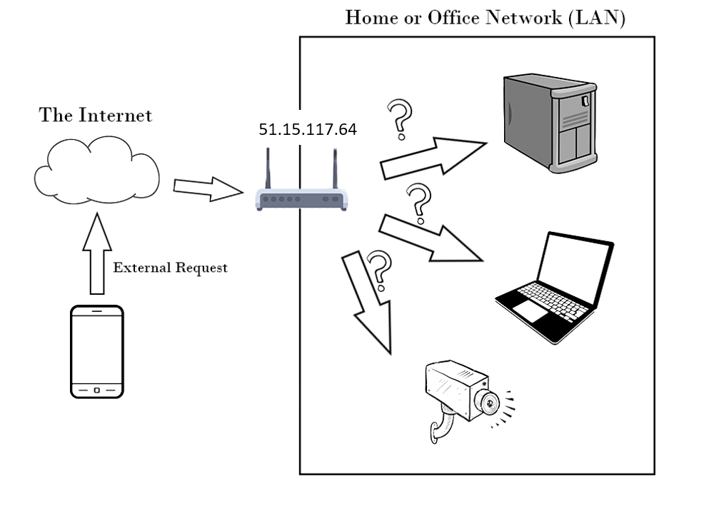

# How to host a website on your home computer

If you've ever wanted to use your own computer as a server to host your website, then this article is for you.\
Many developers want to do this in order to showcase a demo for a website or to express an idea without paying too much for the cloud providers. so here is a free way to do so.

When we think about that there would be 2 main challenges that may oppose us and here we are going to solve them.\
The first is to be able to forward the traffic to our laptop which is lying behind a router while we are having several devices connected to this router and are sharing the same public IP address as shown in the below picture.\

The second challenge is that most of us are having a dynamic public IP and the static one is expensive, so we need to use a domain name instead of using IP address to access the application and this domain name needs to be updated.

So to solve the previous challenges, we are going to use the port forwarding feature in the router configuration to forward all the traffic that is coming from the outside on a specific port to my computer as you can see in the below picture.\

And to solve the next challenge, we can use a dynamic DNS service like **noip**, so we will be able to reserve a domain name like "myhome.ddns.net" for example to point to the router's public IP address.

## Deploy a web server

I will deploy a simple web server on my local machine that just replies with a simple string for every request. This web server will be deployed using docker.\
If docker is not installed on your machine, you can use the script provided in this [gist](https://gist.github.com/mo3taz1705/3f649b52627ab7b00b2d9fb53aa9600e "Github Gist").
Once docker is available, we are going to launch the web server using this command

`$ sudo docker run -p 5000:5678 hashicorp/http-echo -text="Hello world from my home laptop."`

This docker container will bind port 5000 from your host machine to port 5678 inside the container. in order to check if it is working correctly, navigate to "localhost:5000" in your browser, you should see the text message provided in the previous command.

## Configure port-forwarding on your router

You need to login as an admin to the router configuration page. If you don't know the address of the router's configuration page, run this command in the terminal to see it.

`$ ip route show | grep "default via" | awk '{print $3}'`

now copy the ip address printed on your terminal, and navigate to it from your browser.

Once you are logged in as admin user, check the port forwarding tab and select port 5000 as a service port and for the host, you need to write the private IP address of your machine, you can find it by using the upcoming command

`$ hostname -I | awk '{print $1}'`

This is the port forward configuration on my router

At this moment, you need to check that your port is opened successfully by visiting this [website](https://portchecker.co/ "Port Checker - Check Open Ports Online"), in the IP address field write your public IP address and for the port number write the opened port number.

Now we are going to reserve this private IP address to your host machine, so that every time you connect to the router, the same IP address will be assigned to this host machine.
so check the DHCP reservation tab, and select your private IP and bind it to the MAC address of your machine, run these commands to get your MAC address

`$ temp=$(ip route show | grep "default via" | awk '{print $3}' | cut -d '.' -f 1-3)`

`$ ip a | grep $temp\\. -B 1 | grep -v $temp | awk '{print $2}'`

This is the configuration of the DHCP reservation on my router

## Use noip as a dynamic DNS

Go to [noip](https://www.noip.com/sign-up "Create a Free Dynamic DNS No-IP Account") website and create an account, you can use the free basic plan. you need to finish the registration then add the required hostname like "myhome.ddns.net".\
Afterwards, you need to make this hostname to be updated automatically with your public IP address once it has been changed. Thanks to the DUC (dynamic update client) which enables us to do this in a simple way.\
DUC is a binary file that runs on your local machine to update the noip hostname with yor public IP address.\
so we are going to download the tar file

`$ wget https://www.noip.com/client/linux/noip-duc-linux.tar.gz`

then move it to the required directory

`$ sudo mv noip-duc-linux.tar.gz /usr/local/src/ && cd /usr/local/src/`

after that, untar the downloaded file

`$ sudo tar xzf noip-duc-linux.tar.gz && cd noip-2.1.9-1/`

then install noip2

`$ sudo make install`

and change the owner of the generated configuration file to the current user

`$ sudo chown ${USER}:${USER} /usr/local/etc/no-ip2.conf`

now you are able to run the script that updates your hostname, this script needs to be started every time you restart this machine

`$ noip2`

if you want to see the current configuration, use this command

`$ noip2 -S`

For now, you need to check that your hostname and the port is working correctly. so visit the [port checker website](https://portchecker.co/ "Port Checker - Check Open Ports Online"), and write your hostname in the IP address field and for the port number write the opened port number.

## Access your application from another network

Hooray, we reached our final step which is to check that we are able to access the application from another network. you can use your mobile data network and navigate from any browser on your phone to your hostname and port number like this "myhome.ddns.net:5000".

**P.S.**: You can use the same steps to ssh to your home laptop, you just need to setup openssh server on the laptop and configure it to be more secure by preventing any access using passwords and use ssh keys instead. if you need any guidance about that, you can send me an email on moutaz.samir@outlook.com and I will write a tutorial about that.

Stay tuned for the next tutorials !!!
